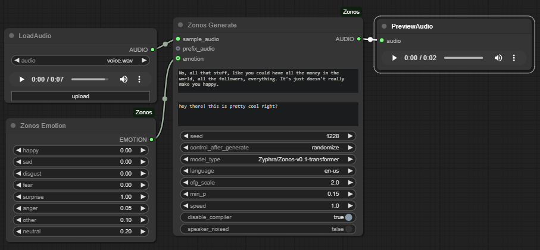

# ComfyUI-Zonos

ComfyUI node to make text to speech audio with your own voices.



** Currently only tested on Windows **

### Installation
* You can `git clone https://github.com/BuffMcBigHuge/ComfyUI-Zonos` into `custom_nodes` or install from ComfyUI-Manager
```
cd custom_nodes/ComfyUI-Zonos
git submodule update --init --recursive
pip install -r requirements.txt
git clone https://github.com/Zyphra/Zonos.git
```
You will need to install eSpeak NG on your machine. 
* **Windows**: You can install [eSpeak NG](https://github.com/espeak-ng/espeak-ng/releases/download/1.52.0/espeak-ng.msi) then have to set `PHONEMIZER_ESPEAK_LIBRARY=C:\Program Files\eSpeak NG\libespeak-ng.dll` in your environment variables, and restart your terminal.
* **Linux**: You can install via `sudo apt-get install espeak-ng` then have to set `PHONEMIZER_ESPEAK_LIBRARY=/usr/lib/libespeak-ng.so` in your environment variables, and restart your terminal. 

### How To Use

* Drop a .wav file into `ComfyUI/input` of a short (5-10s) clear audio of the voice you'd like to use.
* And a .txt file of the same name with what was said.
* Tap "R" in ComfyUI to refresh the node list.
* Use the `ZonosGenerate` and queue a prompt, ([Example Workflow](./examples/comfy-zonos-example.json)).

### Current Issues
* Untested on Mac/Linux
* Model loading isn't handled by Comfy native - ymmv
* Can't get compiling to work - will update when fixed

### Special Thanks

* [Zyphra](https://github.com/Zyphra-AI) for the Zonos model.
* [niknah](https://github.com/niknah) for the F5-TTS node.
* [sdbds](https://github.com/sdbds) for the Zonos-for-windows gradio_interface.py